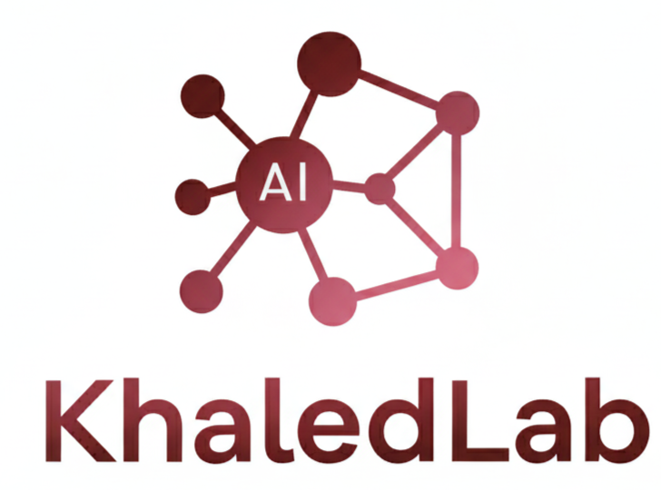

<body>

&nbsp;   <!-- Hero Title -->

&nbsp;   <section class="lab-intro">

&nbsp;       <h2>Welcome to </h2>

&nbsp;       

&nbsp;           

&nbsp;   At the intersection of algorithms, data and discovery, <strong> KhaledLab </strong> seeks to harness the power of <strong> Artificial Intelligence</strong> to solve some of the most pressing challenges in science and society. Based in the Department of Computer Science at Southern Illinois University Carbondale (SIUC) and led by Dr. Khaled Mohammed Saifuddin, our group explores how intelligent systems can be made more robust, efficient, and interpretable. We focus on graph machine learning and graph mining, developing new methods for complex and heterogenous network representation. These advances are applied across diverse domains, from bioinformatics, health data analysis to sequence and event understanding, vision-language reasoning tasks. By bridging fundamental theory with real-world impact, KhaledLab pushes the boundaries of AI toward creating knowledge that is not only powerful, but transformative.

&nbsp;     

 

  🎓 <strong>Join Our Research Team!</strong> Looking for motivated PhD students starting Spring '26 and beyond
  <a href="/lab-site/opportunities/" style="background: white; color: #667eea; padding: 6px 15px; border-radius: 20px; text-decoration: none; font-weight: bold; font-size: 14px;">View →</a>

<h2>Research Interests</h2>
 

&nbsp;   

&nbsp;       
🤖

&nbsp;       <h3>Graph AI</h3>

&nbsp;       
Advancing graph and hypergraph neural networks, graph GenAI with a focus on robustness, efficiency, and interpretability.

&nbsp;   

&nbsp;   

&nbsp;       
🕸️

&nbsp;       <h3>Graph Mining</h3>

&nbsp;       
Discovering patterns, communities, and dynamics in large-scale, complex heterogeneous networks.

&nbsp;   

&nbsp;   

&nbsp;       
🧬

&nbsp;       <h3>AI for Biomedicine</h3>

&nbsp;       
Applying graph-based AI to drug discovery, drug repurposing, bioinformatics, and health data analytics.

&nbsp;   

&nbsp;   

&nbsp;       
📊

&nbsp;       <h3>Sequence and Multimodal Learning</h3>

&nbsp;       
Modeling sequential, temporal, and multimodal data for event prediction, genomics, and vision–language reasoning.

&nbsp;   

&nbsp;   </section>

</body>

