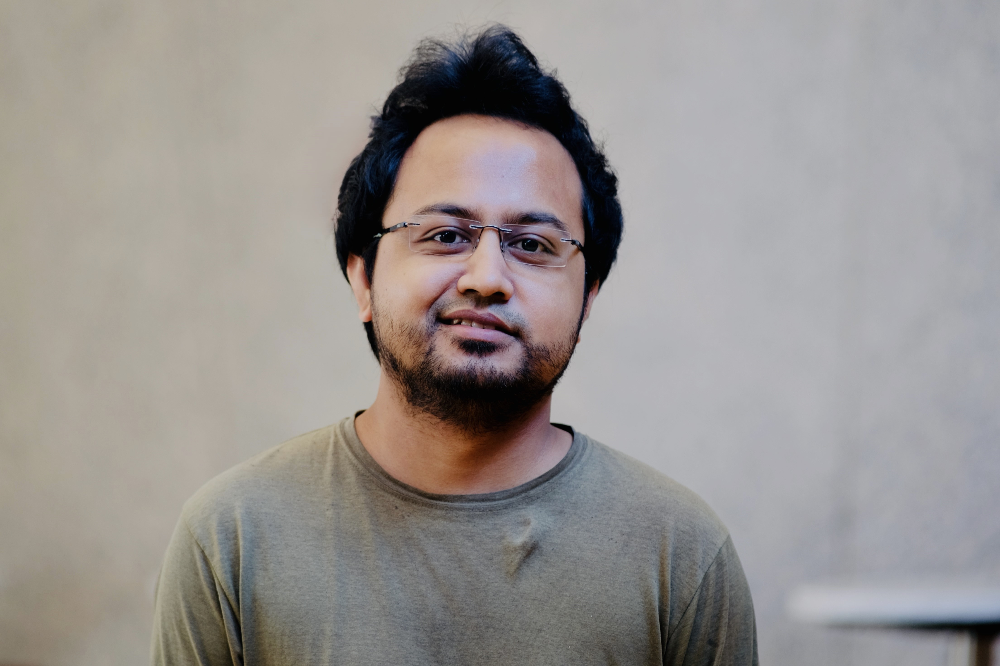
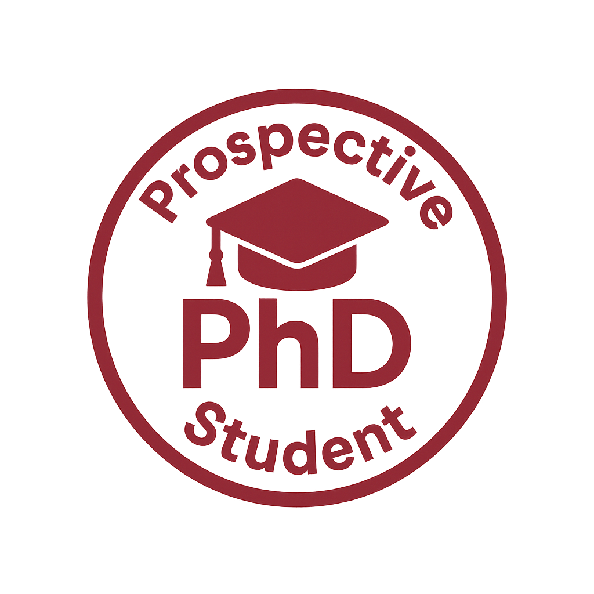

## Lab Director

| | |
|:---|:---|
| {: style="width: 650px; height: 150px; border-radius: 12px; object-fit: cover;"} | **Dr. Khaled Mohammed Saifuddin** *Assistant Professor (Tenure-Track)*  **Email:** [khaledmohammed.saifuddin@siu.edu](mailto:khaled@siu.edu) **Office:** ENG 409  Dr. Khaled Mohammed Saifuddin is a tenure-track Assistant Professor of Computer Science at Southern Illinois University Carbondale. He previously served as a Postdoctoral Research Associate at the Barabási Lab under Albert-László Barabási and earned his Ph.D. in Computer Science from Georgia State University under Dr. Esra Akbas. His research has been published in top venues such as ICDE, CIKM, ECML PKDD, DSAA, BCB, IJCNN, PRICAI, BigData and KDD workshops and presented at Stanford Graph Learning workshop. He has held leadership roles as Area Chair for AI4Science–ICML and NeurIPS. He is the recipient of several awards, including the Outstanding Poster Presentation Award at the Machine Learning in Drug Discovery Symposium 2023 at the Broad Institute of MIT & Harvard, the Dell–Intel Student Award, and the Fraser Travel Award.  **[Personal Website](https://www.khaled-saifuddin.site/)** |

## PhD Students

  🎓 <strong>Join Our Research Team!</strong> Looking for motivated PhD students starting Spring '26 and beyond
  <a href="/lab-site/opportunities/" style="background: white; color: #667eea; padding: 6px 15px; border-radius: 20px; text-decoration: none; font-weight: bold; font-size: 14px;">View →</a>

| | |
|:---:|:---:|
| {: style="width: 150px; height: 150px; border-radius: 50%; object-fit: cover;"}  **Student Name** *PhD Student*  **Email:** [student1@siu.edu](mailto:student1@siu.edu) | {: style="width: 150px; height: 150px; border-radius: 50%; object-fit: cover;"}  **Student Name** *PhD Student*  **Email:** [student2@siu.edu](mailto:student2@siu.edu) |